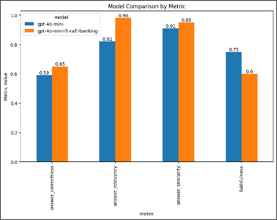

## Improving Retrieval Augmented Generation with Fine Funing

While most organizations that invest in Generative AI have experimented with Retrieval Augmented Generation (RAG) in order to extend an LLM's knowledge with their own internal knowledge base, many are not getting the results they expect without significant optimization work. There are several ways to optimize RAG-based systems in order to get LLM outputs that are relevant, specific to the right documents and aligned with the desired communication style. 

A lot of the focus is usually put on optimizing the "Retrieval" part of RAG. However, in some cases, even when provided with documents containing elements of answer to a question, LLMs still generate answers that are inaccurate. [Retrieval Augmented Fine-Tuning (RAFT)](https://techcommunity.microsoft.com/t5/ai-ai-platform-blog/raft-a-new-way-to-teach-llms-to-be-better-at-rag/ba-p/4084674) is a novel method that focuses on improving the generation part of RAG systems by teaching the model to extract and use the right information from retrieved domain specific documents through Supervised Fine Tuning (SFT).

The latest announcements around Fine Tuning in Azure OpenAI have made implementing RAFT a no-brainer for organizations looking to improve their RAG systems leveraging Azure OpenAI models. Fine-tuning on Azure OpenAI is now generally available for GPT-4o and GPT-4o-mini models, making fine tuning state of the art models a reality. Additionally, Azure OpenAI recently released a new [per-token pricing](https://techcommunity.microsoft.com/t5/ai-azure-ai-services-blog/pricing-update-token-based-billing-for-fine-tuning-training/ba-p/4164465) for fine tuning which makes RAFT and other fine tuning tasks both cost-efficient and highly predictable from a cost standpoint. 

If you're interested in experimenting with Retrieval Augmented Fine Tuning for your Azure OpenAI models, read on!

## Unlock the Power of RAFT Fine-Tuning with Azure OpenAI: Explore Our New Self-Paced Hands-On Lab!

Are you a developer looking to enhance your conversational assistant's performance? Struggling with domain adaptation and incorrect answers? Look no further! Our self-paced, hands-on workshop on **Retrieval Augmented Fine-Tuning (RAFT)** using Azure OpenAI is here  https://aka.ms/aoai-raft-workshop to help you take your AI projects to the next level.

In today's fast-paced world, having a conversational assistant that can accurately answer domain-specific questions is crucial. Whether you're working in banking, healthcare, or any other industry, RAFT can help you fine-tune your language models to provide precise and relevant answers. This workshop is designed to be educational and practical, giving you the tools and knowledge to implement RAFT effectively at your own pace.

This Hands-On Lab was heavily inspired by Cedric Vidal and Suraj Subramanian excellent [blog](https://techcommunity.microsoft.com/t5/ai-ai-platform-blog/raft-a-new-way-to-teach-llms-to-be-better-at-rag/ba-p/4084674) and github [reference implemenation](https://github.com/ShishirPatil/gorilla/tree/main/raft)

### Lab Overview

#### Scenario

Imagine you're a developer at a bank, tasked with improving a conversational assistant that answers questions about the bank's accounts and online tools. Despite trying Prompt Engineering and Retrieval-Augmented Generation (RAG), the assistant still provides incorrect answers and lacks domain adaptation. RAFT could be the solution you need to validate and enhance the assistant's performance.

#### What is RAFT?

**Retrieval Aware Fine-Tuning (RAFT)** is a novel approach to preparing fine-tuning data for domain-specific open-book settings, similar to in-domain RAG. RAFT is a groundbreaking approach to language models that combines the benefits of RAG and fine-tuning. This technique tailor’s language models to specific domains by enhancing the models ability to comprehend and utilize domain-specific knowledge. RAFT sits in the middle-ground between RAG and domain-specific SFT. 

 In RAFT, each data point includes a question (Q), a set of documents (Dk), and a Chain-of-Thought style answer (A) generated from one of the documents (D). The documents are categorized into:

- **Oracle Documents (Do)**: Contain the answer to the question.
- **Distractor Documents (Di)**: Do not contain answer-relevant information.

 We will use synthetic data generation techniquest to generate the documents. We will utilize Teacher **GPT-4o** / Student **GPT-4o mini** Model Training using Distillation. 
 Customers can leverage powerful large models as a teacher model to train small student through distillation, resulting in tailored models ready for use in domain-specific use cases
 
 **Distillation Steps:**

1. **Teacher Model**: The large model generates synthetic data predictions – knowledge transfer

2. **Student Model**: The smaller model is trained to mimic the behavior of the teacher model by learning from data prediction outputs. The student model is typically much smaller and faster than the teacher model

Training Data - student model uses the teacher’s predictions as training data, which can include both labeled and unlabeled data.

Want to learn more details about RAFT?See the arxiv.org paper: RAFT: Adapting Language Model to Domain Specific RAG https://arxiv.org/html/2403.10131v1

### How to Get Started

All you need is access to an Azure subscription and the ability to create Azure OpenAI resources and deployments. There's no need to enroll—just dive in and start learning with the Hands-On Workshop! You'll get to work with your data or choose a sample pdf document included in repo.

#### Hands-On Lab:

To get started head over to  https://aka.ms/aoai-raft-workshop and begin with:
1. **[Pre-requisites and Setup](https://aka.ms/aoai-raft-workshop)**
   - How to set up your environment and install necessary packages.
   - Creating a **Teacher GPT-4o / Student GPT-4o mini** Model deployments on Azure.

2. **[Step 1 – Prepare/Generate synthetic training dataset](https://github.com/Azure-Samples/azure-openai-raft/blob/main/1_raft_datagen.ipynb)**
   - Collect Domain-Specific Documents: Gather documents relevant to the domain you want to specialize the LLM
   - Loading and Chunking Domain-Specific Documents 
     * Converting PDF documents to markdown.
     * Chunk the file into Documents  using Langchain.
      * For each Document chunk, generate synthetic data ( Question-Documents-Answer triplets) such that each data point contains a question, a set of documents (golden + distractors ), and a corresponding Chain-of-though style answer  generated from chunk. 
        * We differentiate between two types of documents: golden documents (highly relevant) 
        * Distractor documents that do not contain relevant information for answer
     * Formatting data for fine-tuning.
   - Splitting Data into Training and Test Sets

2. **[Step 2 –  RAFT GPT-4o-mini fine tuning](https://github.com/Azure-Samples/azure-openai-raft/blob/main/2_raft_finetuning.ipynb)**
   - Uploading the training and validation data to Azure OpenAI
   - Creating the fine tuning job
     *  Fine tune our model using the Supervised Fine Tuning technique. Azure OpenAI uses LoRA to fine tune models efficiently. LoRA (Low-Rank Adaptation) finetuning of a Large Language Model is a technique used to adapt pre-trained language models to specific tasks efficiently and with fewer computational resources.
   - Monitor the fine tuning job
   - Analyze the fine tuned model in Azure OpenAI Studio
   - Create a new deployment with the fine tuned model
   
3. **[Step 3 –  Model evaluation](https://github.com/Azure-Samples/azure-openai-raft/blob/main/3_raft_evaluation.ipynb)**
   - Validate that the fine tuning actually improve the model's performance on our RAG task
   - You should see an improved model results like this: 

      

---

Ready to unlock the power of RAFT Fine-Tuning? https://aka.ms/raftworkshop

Get started now and take the first step towards mastering domain-specific AI with Azure OpenAI!

---
References:

* [2006.05525] Knowledge Distillation: A Survey (arxiv.org) https://arxiv.org/abs/2006.05525
* RAFT: Adapting Language Model to Domain Specific RAG https://arxiv.org/html/2403.10131v1
* RAFT:  A new way to teach LLMs to be better at RAG  https://techcommunity.microsoft.com/t5/ai-ai-platform-blog/raft-a-new-way-to-teach-llms-to-be-better-at-rag/ba-p/4084674